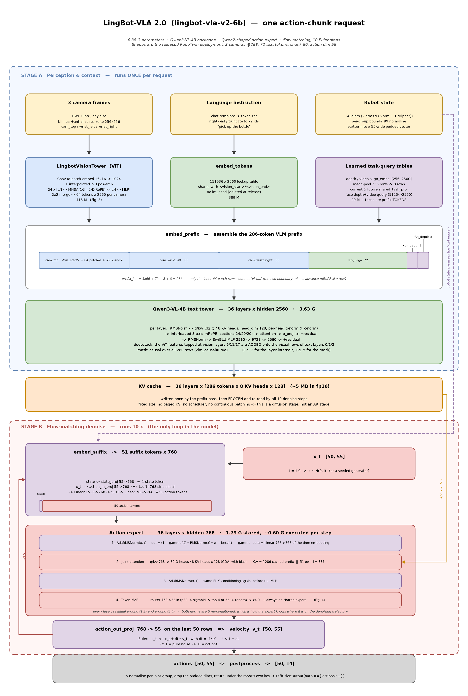
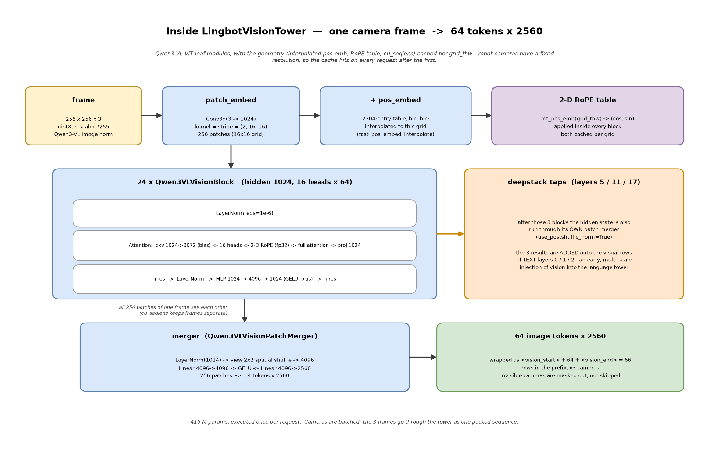
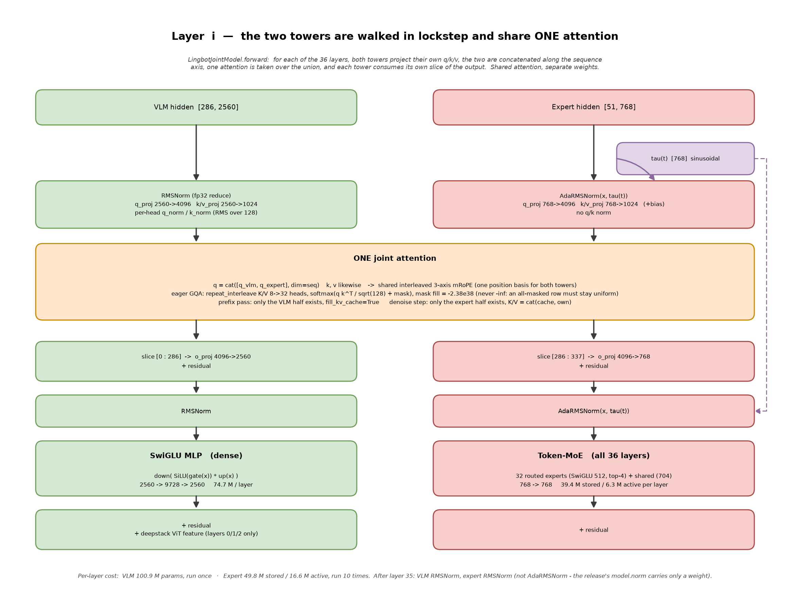
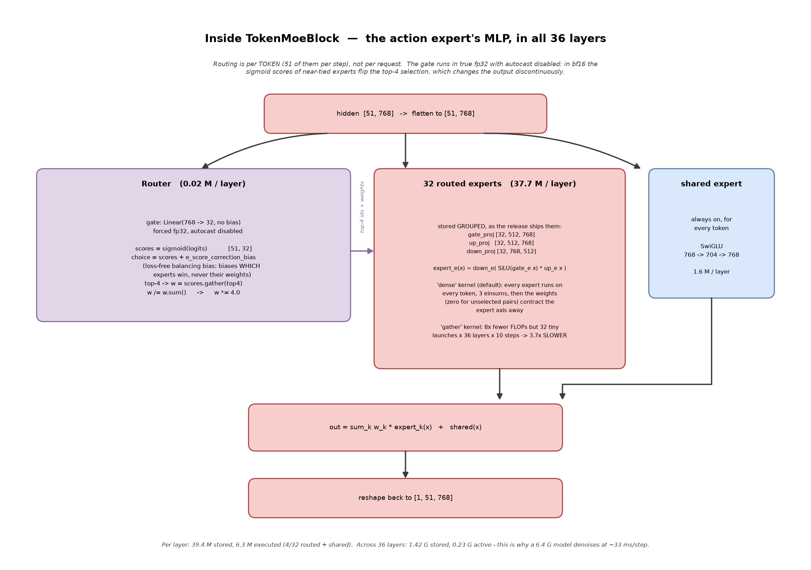
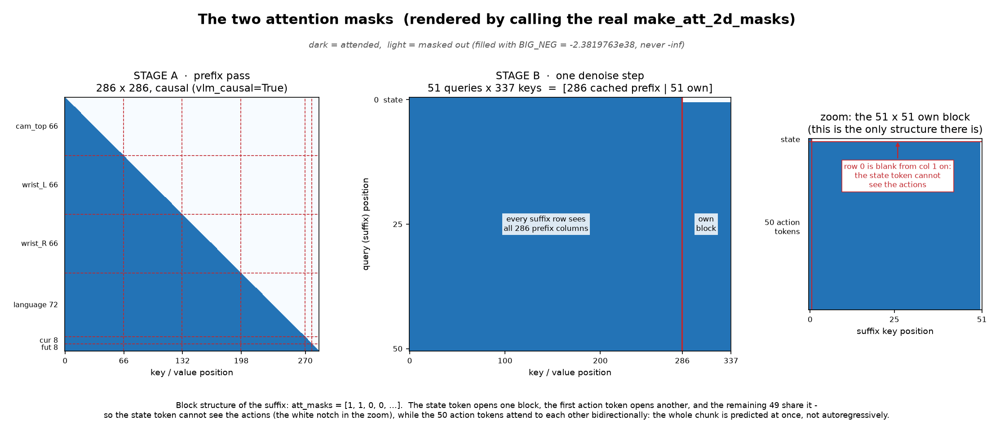
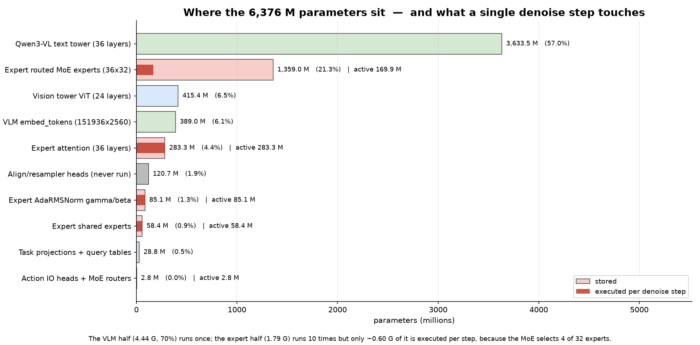

# lingbot-vla-v2-6b 模型架构

> 本文描述 **vllm-omni 中 `vllm_omni/diffusion/models/lingbot_vla_v2/` 实际运行的那个模型**，
> 形状全部取自已发布的 RoboTwin 部署（`transformer/config.json` + `lingbot-vla-v2-6b` 权重清单），
> 不是论文里的抽象结构。所有数字都能在代码或 safetensors 头里查到。
>
> 图由 `spikes/lingbot_vla_v2/draw_model_arch.py` 生成（容器内没有中文字体，图内一律英文；
> 中文解释在正文）。重绘：
>
> ```bash
> python spikes/lingbot_vla_v2/draw_model_arch.py
> # 可选：从真实 checkpoint 重新统计参数量
> python spikes/lingbot_vla_v2/draw_model_arch.py --checkpoint /llm/zhuyong/lingbovla/models/lingbot-vla-v2-6b
> ```

---

## 0. 一句话概括

**一个 Qwen3-VL-4B 视觉语言塔 + 一个 Qwen2 形状的动作专家塔，36 层锁步前进、共享同一次注意力；
VLM 塔只跑一次留下 KV cache，动作专家塔在这个 cache 上跑 10 次流匹配（flow matching）Euler 积分，
把高斯噪声推成一段 50 步的动作序列。**

两个塔**共享注意力、不共享权重**。整个模型里只有一个循环：那 10 个去噪步。

| | VLM 塔 | 动作专家塔 |
|---|---|---|
| 隐藏维 | 2560 | 768 |
| 层数 | 36 | 36 |
| 注意力头 | 32 Q / 8 KV × 128 | 32 Q / 8 KV × 128 |
| MLP | 稠密 SwiGLU 2560→9728→2560 | 每层 token-MoE（32 选 4 + 共享专家） |
| 归一化 | RMSNorm | AdaRMSNorm（被时间步 t 调制） |
| 序列 | 286 个 prefix token | 51 个 suffix token（1 state + 50 action） |
| 执行次数 | 1 次 / 请求 | 10 次 / 请求 |
| 参数 | 4.44 G（含 ViT 与词表） | 1.79 G 存储，每步实际执行约 0.60 G |

---

## 1. 全景：一次请求的完整数据流



分两个阶段，**阶段 A 只跑一次，阶段 B 跑 10 次**：

**阶段 A（感知与上下文）**
1. 3 路相机图 → ViT → 每路 64 个 token；语言指令 → 词表查表 → 72 个 token；
   两张学习到的"任务查询表" → 各 8 个 token。
2. `embed_prefix` 把它们拼成 **286 个 prefix token × 2560**。
3. 这 286 个 token 走完 VLM 的 36 层（因果掩码），**每层的 K/V 写进 cache 后冻结**。
4. **机器人关节状态完全不进 VLM**——它是阶段 B 的输入（图中右侧那条紫色虚线）。

**阶段 B（流匹配去噪）**
1. `embed_suffix` 把 state 和当前带噪动作 `x_t` 变成 **51 个 suffix token × 768**。
2. 这 51 个 token 走动作专家的 36 层。每层做注意力时，K/V = `[286 个缓存的 prefix ‖ 自己的 51]` = **337**。
3. 最后 50 行经 `action_out_proj 768→55` 得到速度场 `v_t`。
4. Euler：`x_t ← x_t + dt·v_t`，`dt = -1/10`，`t` 从 1.0（纯噪声）走到 0.0（动作）。回到第 1 步，共 10 轮。
5. 反归一化、丢掉 padding 维，返回 `[50, 14]`。

> **为什么值得这样设计**：图像和语言的编码代价（4.44 G 参数）只付一次；每一步去噪只付
> 动作专家那 0.60 G。这就是 6.4 G 的模型能在单步 ~33 ms 内完成一次去噪的原因。

---

## 2. 输入侧：三条支路和它们的内部

### 2.1 视觉塔 `LingbotVisionTower`（`modeling_...py:556`）



每帧 `256×256×3`（分辨率来自 `RobotSpec.image_size`，即训练配置的 `img_size`，
**不是** `config.image_resolution` 里的 224），逐级变换：

| 子模块 | 内部做什么 | 形状 |
|---|---|---|
| `patch_embed` | `Conv3d(3→1024)`，`kernel = stride = (2, 16, 16)`，带 bias。时间维 2 是为视频准备的，单帧被复制成 2 帧 | `[256, 1024]`（16×16 网格） |
| `+ pos_embed` | `nn.Embedding(2304, 1024)`，即 48×48 的位置表，用 `fast_pos_embed_interpolate` 双三次插值到当前网格 | 同上 |
| 2-D RoPE 表 | `rot_pos_emb(grid_thw)` 生成 `(cos, sin)`，在**每个** block 内部作用于 q/k | — |
| `blocks` × 24 | 见下 | `[256, 1024]` |
| `merger` | `LayerNorm(1024)` → 2×2 空间重排 view 成 4096 → `Linear 4096→4096` → GELU → `Linear 4096→2560` | `[64, 2560]` |

**一个 `Qwen3VLVisionBlock` 内部**（标准 pre-norm ViT block）：

```
x → LayerNorm(eps=1e-6) → Attention → +x
  → LayerNorm            → MLP       → +x

Attention: qkv = Linear(1024→3072, bias) → 拆成 16 头 × 64
           → 2-D RoPE（fp32 计算后转回）→ 全注意力（同一帧内 256 个 patch 互相可见，
             跨帧由 cu_seqlens 隔开）→ proj Linear(1024→1024)
MLP:       linear_fc1 1024→4096 → GELU → linear_fc2 4096→1024（均带 bias）
```

**deepstack（多尺度视觉注入）**：第 5/11/17 个 block 之后，把当时的 hidden state 额外送进
**它自己的** `Qwen3VLVisionPatchMerger(use_postshuffle_norm=True)`（即 LayerNorm 放在 2×2 重排*之后*），
得到 3 组 `[64, 2560]`。这 3 组会在文本塔的第 0/1/2 层**加到视觉行上**——相当于把浅、中、深三个尺度的
视觉特征在语言塔的最前面就注入进去，而不是只给最后一层的输出。

几何量（插值后的位置嵌入、RoPE 表、`cu_seqlens`）按 `grid_thw` 做了缓存；机器人相机分辨率固定，
所以除第一次外每次都命中。

### 2.2 `embed_tokens`

`151936 × 2560` 的查表，389 M 参数，占全模型 6.1%。`<vision_start>` / `<vision_end>` 也从这里取。
**`lm_head` 在发布版里已被删除**——这个模型不输出 token。

### 2.3 学习到的任务查询表

`depth_align_embs`、`current_video_align_embs`、`future_depth_align_embs`、`future_video_align_embs`
各是 `[256, 2560]` 的 `nn.Parameter`。推理时：

1. `_pool_align_tokens`：`view(8, 32, 2560).mean(1)`，256 行**跨步**均值池化成 8 行；
2. depth 查询和 video 查询 `cat` 成 5120 维，过 `current_shared_task_proj / future_shared_task_proj`
   （`Linear 5120→2560`）融合成一路；
3. 得到 `current_depth` 8 个 + `future_depth` 8 个，**作为 prefix token 拼进序列**。

> 关键点：**它们是 token，不是 head**。训练时与之配对的对齐头（Perceiver resampler + MoGe 深度头，
> 76 个张量 / 120.68 M 参数）在推理里**根本没有被构造**，`load_weights` 直接丢弃。但查询表本身必须保留，
> 因为删掉它们 prefix 长度就变了。

### 2.4 `embed_prefix` 的拼装规则（`:1344`）

```
[<vision_start> 64patch <vision_end>] × 3 路相机   = 198
[语言 72（右侧 padding / 截断）]                     =  72
[current_depth 8]  [future_depth 8]                =  16
                                              总计 = 286
```

三件容易搞错的事，代码里都有明确处理：

- **只有中间那 64 个 patch 行算"视觉"**。两个边界 token 按文本处理：不接收 deepstack 特征，
  mRoPE 位置也按文本 +1 推进。
- **不可见的相机不是被跳过，而是被 mask 掉**（`img_masks`）。序列长度恒定 286，这是 diffusion stage
  能静态编译的前提。
- **mRoPE 位置 id**（`build_prefix_position_ids:1269`）：文本每个 token 三个轴各 +1；
  一张图整体只推进 `max(h, w) // spatial_merge_size` 个位置，同时把 `(t, h, w)` 三元索引铺在它的
  token 上——所以 16×16 网格在 merge=2 下只花 8 个位置，而不是 64 个。
  这个函数是照着 HF `Qwen3VLModel.get_rope_index` 重写的（HF 4.57 → 5.x 改了签名），
  它喂给全模型每一个位置 id，是 Phase 0 唯一发现的**行为性**不兼容点。

---

## 3. 核心：36 层锁步 + 一次联合注意力



`LingbotJointModel.forward`（`:1081`）是全模型**唯一**发生注意力的地方。第 `i` 层：

```python
for tower in (vlm, expert):            # 两个塔各算各的 q/k/v
    q, k, v = tower.layers[i].compute_qkv(...)
q = cat([q_vlm, q_expert], dim=seq)    # 沿序列轴拼起来
k, v 同理
q, k = apply_mrope(q, k, position_ids) # 共用 VLM 的 rotary_emb —— 一套位置基
att = attention(q, k, v, mask)         # 只有这一次注意力
for tower in (vlm, expert):            # 各取各的切片继续走
    tower.layers[i].apply_attention(h, att, start, end)
```

两次调用的区别只在传什么：

| | prefix 填充 | 去噪步 |
|---|---|---|
| `inputs_embeds` | `[prefix, None]` | `[None, suffix]` |
| `fill_kv_cache` | `True` | `False` |
| K/V | 当场算，写进 cache | `cat(cache, 自己的)` = 337 |
| `ada_cond` | 不传 | 传时间嵌入 `tau(t)` |

因为每次只有一个塔非空，"拼接"退化成恒等——**同一份代码同时表达了自注意力和跨塔注意力**。

### 3.1 VLM 解码层内部（`VlmDecoderLayer:659`）

```
h → RMSNorm（fp32 求方差）
  → q_proj 2560→4096 / k_proj,v_proj 2560→1024   （无 bias）
  → 逐头 q_norm / k_norm（在 head_dim=128 上做 RMS —— Qwen3 特有）
  → 交错式三轴 mRoPE（mrope_section = [24, 20, 20]，interleaved=True）
  → [ 联合注意力 ]
  → 取 slice[0:286] → o_proj 4096→2560 → + 残差
  → RMSNorm → SwiGLU: down(SiLU(gate(x)) * up(x))，2560→9728→2560 → + 残差
  → （仅第 0/1/2 层）把 deepstack 特征加到视觉行上
```

每层 100.9 M 参数 = 注意力 26.2 M + MLP 74.7 M。

### 3.2 动作专家解码层内部（`ExpertDecoderLayer:919`）

结构和 VLM 层**完全同构**，只有三处不同：

```
h → AdaRMSNorm(h, tau(t))                      ← ① 两个归一化都被时间调制
  → q/k/v 768→4096 / 768→1024（带 bias）        ← ② 有 bias，且没有 q/k norm
  → 同一套 mRoPE（位置从 prefix 的最大位置往后接着数）
  → [ 联合注意力 ]
  → 取 slice[286:337] → o_proj 4096→768 → + 残差
  → AdaRMSNorm(h, tau(t))
  → TokenMoeBlock                              ← ③ MLP 换成 token 级 MoE
  → + 残差
```

每层 49.8 M 存储 / 16.6 M 实际执行：
注意力 7.87 M + 路由专家 37.7 M（实际 4.72 M）+ 共享专家 1.62 M + 路由器 0.025 M + AdaRMSNorm 的 γ/β 2.36 M。

第 35 层之后，专家塔过一个**普通 RMSNorm**（发布版 `final_norm_adanorm=False`，`model.norm` 只有一个 weight）。

### 3.3 `AdaRMSNorm` 内部（`:471`）—— 模型怎么知道"现在走到轨迹哪儿了"

```
out = (1 + γ(t)) ⊙ ( w ⊙ rmsnorm(x) ) + β(t)

γ = Linear(768 → 768)(tau(t))      # 每层独立一份
β = Linear(768 → 768)(tau(t))
tau(t) = 正弦时间嵌入，768 维，周期带 [4e-3, 4.0]
```

这是标准的 FiLM 条件化。`rmsnorm` 部分在 fp32 里算；`γ/β` 用参数 dtype 算（上游有 `AdaRMSNorm` 和
`FixAdaRMSNorm` 两个变体，发布版的逐层归一化是前者）。

全模型 36 层 × 2 个 AdaRMSNorm × 2 个 `Linear(768,768)` = **85.1 M 参数只用来做时间条件化**，
比整个共享专家（58.4 M）还多。VLM 塔没有任何时间条件化——它看不见 t，也不需要看见。

### 3.4 联合注意力内部（`eager_attention:143`）

```
K/V 从 8 头 repeat_interleave 到 32 头（GQA）
scores = q @ kᵀ / sqrt(128)
scores = scores.masked_fill(~mask, BIG_NEG)     # BIG_NEG = -2.3819763e38
out = softmax(scores, dtype=fp32) @ v
```

**为什么是 `-2.38e38` 而不是 `-inf`**：padding 行可能整行都被 mask 掉。`-inf` 会让 softmax 出 NaN；
`-2.38e38`（fp32 有限最小值附近）会让这一行退化成均匀分布，和 openpi / 上游 LingBot 逐位一致。
这个常量是数值对齐的一部分，不能"顺手改成 -inf"。

`attention_precision` 默认 `fp16`（配置里写死），`fp32` 路径是数值基准。
另有多个后端（`sdpa` / `ipex_prefix` / `flash_*`）可选，默认全部走 `eager`。

---

## 4. `TokenMoeBlock` —— 动作专家的 MLP（36 层每层都有）



**路由是逐 token 的**（每步 51 个 token 各自选专家），不是逐请求的。`forward`（`:887`）：

```python
with autocast(enabled=False):                       # ① 强制 fp32
    logits = F.linear(x.float(), gate.weight.float())   # gate: 768→32, 无 bias
scores = logits.sigmoid()                            # ② sigmoid，不是 softmax
choice = scores + e_score_correction_bias            # ③ 只偏置"选谁"
_, idx = topk(choice, k=4)
w = scores.gather(1, idx)                            #    权重仍取无偏置的 scores
w = w / (w.sum(-1, keepdim=True) + 1e-20)            # ④ 重归一化
w = w * 4.0                                          # ⑤ routed_scaling_factor
out = Σ_k w_k · expert_{idx_k}(x)  +  shared(x)      # ⑥ 共享专家恒开
```

四个坑，注释里都点名了：

1. **gate 必须真 fp32 且关掉 autocast**。bf16 下近似打平的两个专家 sigmoid 值会翻转 top-4 选择，
   输出会不连续地跳变——这不是精度损失，是选择结果变了。
2. **`e_score_correction_bias` 只影响选择，不影响权重**。它是 loss-free 负载均衡偏置，推理时冻结
   （`bias_update_speed` 必须为 0）。加到 `choice` 上做 topk，但 `gather` 回来的是原始 `scores`。
3. **重归一化之后还要乘 4.0**（`routed_scaling_factor`）。漏掉这一步幅度会差 4 倍。
4. **共享专家对每个 token 恒开**，SwiGLU `768→704→768`，和路由结果相加。

**专家权重是分组存储的**（`GroupedExperts:796`），直接对应发布 checkpoint 的张量布局：

```
gate_proj [32, 512, 768]    up_proj [32, 512, 768]    down_proj [32, 768, 512]
expert_e(x) = down_e( SiLU(gate_e x) * up_e x )
```

两个等价 kernel：

- **`dense`（默认）**：3 个 einsum，每个专家都在每个 token 上算，然后用路由权重（未选中处为 0）
  把专家轴收缩掉。这是上游的 eager 路径，也是 fp32 golden 的产生方式。
- **`gather`**：每个专家只算路由到它的 token，top-4/32 下算力少 8×——但作为 32 个专家的 Python 循环，
  一次请求要付约 7 万次 kernel launch，**在 B60 上实测慢 3.7 倍**。保留它是因为换成 grouped kernel
  或 launch 便宜的设备上，算力论证才成立。详见 `PHASE5_PERF.md`。

每层 39.4 M 存储 / 6.3 M 执行；36 层合计 1.42 G 存储、0.23 G 激活。

---

## 5. 后缀侧：`embed_suffix` 与 Euler 积分

### `embed_suffix`（`:1455`）

```
state   → state_proj 55→768                                        →  1 个 state token
x_t     → action_in_proj 55→768
          ⊕ tau(t)（768 维正弦时间嵌入，沿 chunk 广播）→ cat 成 1536
          → action_time_mlp_in 1536→768 → SiLU → action_time_mlp_out 768→768
                                                                   → 50 个 action token
```

注意时间信息**进来两次**：一次在这里拼进 token 表示，一次在每层 AdaRMSNorm 里做 FiLM。

`att_masks = [True, True, False, False, ...]`，这一串 bool 是块结构的紧凑编码：
state token 开一个块，第一个 action token 开另一个块，后 49 个共享该块。

### `sample_actions` / `denoise_actions` / `predict_velocity`（`:1530` / `:1586` / `:1619`）

```python
x_t = noise                     # t = 1.0, x ~ N(0, I)
dt  = -1.0 / 10
for _ in range(10):
    v_t = predict_velocity(state, cache, x_t, t)   # 一次 36 层的专家前向
    x_t = x_t + dt * v_t
    t   = t + dt
return x_t                      # t = 0.0
```

约定：**t=1 是噪声，t=0 是动作**，显式 Euler 等步长积分。
`predict_velocity` 取专家输出的最后 50 行（丢掉 state 行）过 `action_out_proj 768→55`。

> 一处与上游的有意分歧：上游写 `x_t = noise` 然后原地 `x_t += dt * v_t`，会把调用方的噪声张量
> 就地去噪。复用噪声 buffer 的 pipeline 因此会让第 n 个请求从第 n-1 个请求的动作块开始迭代。
> 这里不再别名 `noise`。

---

## 6. 两张注意力掩码



两张图都是**直接调用代码里的 `make_att_2d_masks`** 画出来的，不是手绘示意。

**阶段 A（286×286）**：`vlm_causal=True`，纯因果。所以相机 2 能看见相机 1，语言能看见全部图像，
两个查询段能看见前面一切。

**阶段 B（51×337）**：
- 左边 286 列（缓存的 prefix）**对每个 suffix 行全部可见**——只受 padding 约束；
- 右边 51×51 是自己的块结构：**state token 看不见 50 个 action token**（右图顶部那一行缺口），
  而 50 个 action token 之间**双向互相可见**——整段 chunk 是一次性预测出来的，不是自回归。
- 反过来，prefix **永远看不见** suffix（阶段 A 跑的时候 suffix 还不存在），这正是 KV cache 能冻结的原因。

`make_att_2d_masks` 用的是 big_vision 风格的累积块编码：`att_masks` 的每个 `True` 开一个新块，
`cumsum` 之后 "我的块号 ≥ 你的块号" 就是可见。这种编码能表达"看不见我之后的东西"，
但表达不了"看不见我前面的某一段"——所以 `_block_query_columns`（`:1505`）是在**已经建好的矩阵上**
把矩形区域置 False 的（发布版 RoboTwin 配置里这两个开关都关着）。

---

## 7. 参数账本



真实 checkpoint（1708 个张量）统计：

| 分组 | 参数量 (M) | 占比 | 每步去噪执行 |
|---|---:|---:|---|
| VLM 文本塔（36 层） | 3633.51 | 57.0% | 否 |
| 专家路由 MoE（36×32） | 1358.95 | 21.3% | 仅 4/32 → 169.9 M |
| ViT 视觉塔（24 层） | 415.35 | 6.5% | 否 |
| VLM `embed_tokens` | 388.96 | 6.1% | 否 |
| 专家注意力（36 层） | 283.34 | 4.4% | 全部 |
| **对齐头 / resampler（从不执行）** | **120.68** | **1.9%** | **从不构造** |
| 专家 AdaRMSNorm γ/β | 85.10 | 1.3% | 全部 |
| 专家共享专家 | 58.39 | 0.9% | 全部 |
| 任务投影 + 查询表 | 28.84 | 0.5% | 否（阶段 A） |
| 动作 IO 头 + MoE 路由器 | 2.78 | 0.0% | 全部 |
| **合计** | **6375.91** | 100% | 每步约 0.60 G |

两个值得记住的结论：

- **70% 的参数（VLM 那一半）只跑一次**；10 次去噪循环里真正被反复执行的只有专家那 1.79 G，
  而 MoE 又让其中每步只碰 0.60 G。
- **1.9% 的参数在推理时完全不存在**——`load_weights` 看到 `align_head` / `resampler` 就丢弃，
  并在日志里报告丢了多少个张量（不是静默跳过，也不是警告）。

---

## 8. 形状速查

| 量 | 值 | 出处 |
|---|---|---|
| prefix 长度 | 286 = 3×66 + 72 + 8 + 8 | `embed_prefix` |
| suffix 长度 | 51 = 1 + 50 | `embed_suffix` |
| 去噪时 K/V 长度 | 337 = 286 + 51 | `predict_velocity` |
| 每相机 token | 66 = 1 + 64 + 1 | 256×256 → 16×16 patch → 2×2 merge |
| 图像分辨率 | 256×256 | `RobotSpec.image_size`（**非** config 的 224） |
| 语言长度 | 72 | `tokenizer_max_length` |
| chunk / 动作维 | 50 / 55（padding 后），实际输出 14 | `chunk_size`, `max_action_dim` |
| 去噪步数 | 10 | `num_steps` |
| KV cache | 36 × [286 × 8 × 128] ≈ 5 MB (fp16) | 固定大小，无分页 |

**这是一个 diffusion stage，不是 AR stage**：没有分页 KV、没有调度器、没有 continuous batching。
形状全程固定，所以 `predict_velocity` 可以被 Inductor 整图编译（`compile_denoise_step=True`）。
输出走 `DiffusionOutput(output={"actions": ndarray})`。

---

## 9. 代码索引

`vllm_omni/diffusion/models/lingbot_vla_v2/modeling_lingbot_vla_v2.py`：

| 行 | 符号 | 作用 |
|---:|---|---|
| 108 | `create_sinusoidal_pos_embedding` | 时间嵌入 τ(t)，周期带 [4e-3, 4.0] |
| 128 | `make_att_2d_masks` | big_vision 式累积块掩码 |
| 143 | `eager_attention` | GQA + `BIG_NEG` 填充，数值基准路径 |
| 447 / 471 | `RMSNorm` / `AdaRMSNorm` | 两塔各自的归一化 |
| 506 | `prefix_query_segments` | 发布版返回 `(language, current_depth, future_depth)` |
| 556 | `LingbotVisionTower` | ViT + 几何缓存 + deepstack 抽头 |
| 659 | `VlmDecoderLayer` | `compute_qkv` / `apply_attention` 一分为二 |
| 796 / 857 | `GroupedExperts` / `TokenMoeBlock` | MoE 权重布局与路由 |
| 919 | `ExpertDecoderLayer` | 专家层（AdaRMSNorm + MoE） |
| 1081 | `LingbotJointModel.forward` | **锁步走 36 层，全模型唯一的注意力** |
| 1269 | `build_prefix_position_ids` | 三轴 mRoPE 位置 id |
| 1344 / 1455 | `embed_prefix` / `embed_suffix` | 两端的 token 拼装 |
| 1530 / 1586 / 1619 | `sample_actions` / `denoise_actions` / `predict_velocity` | 两趟前向与 Euler 循环 |
| 1656 | `load_weights` | 镜像式加载，丢弃对齐头 |

相关文档：`ARCHITECTURE.md`（移植设计）、`PHASE5_PERF.md`（MoE kernel 与性能）、
`phase1_parity.py`（逐阶段 fp32 对齐测试）。
